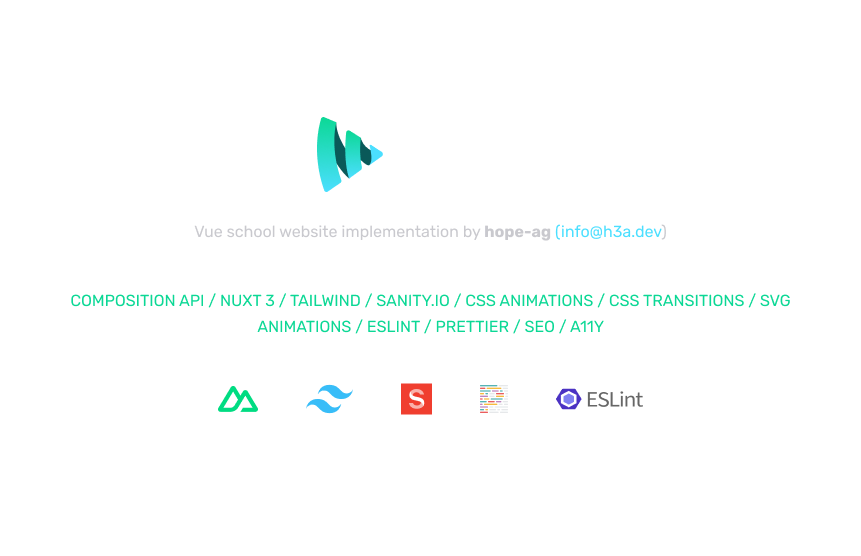
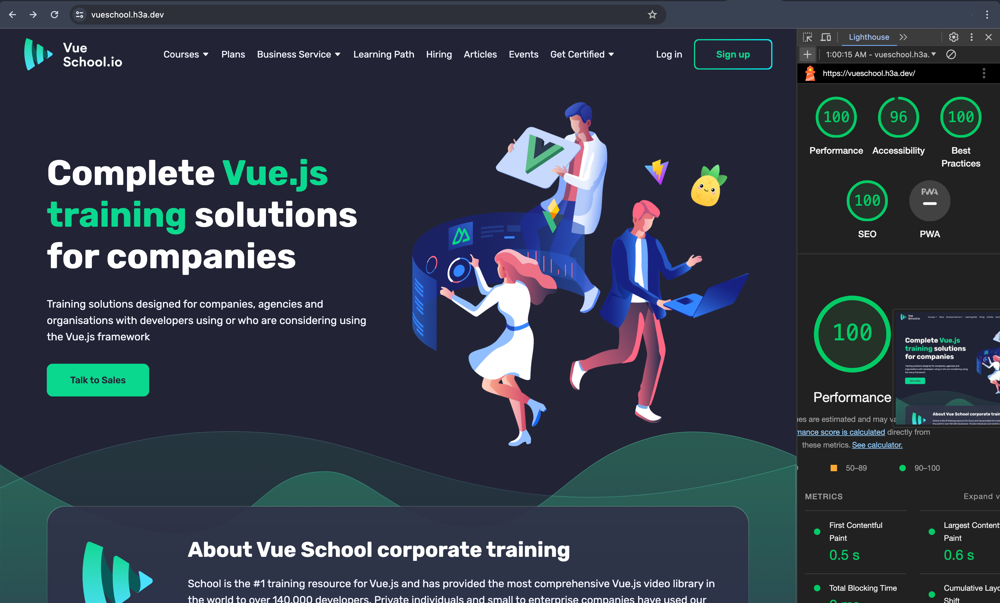
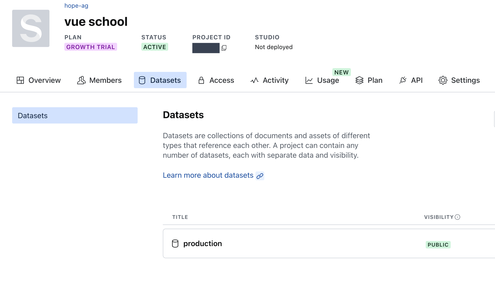
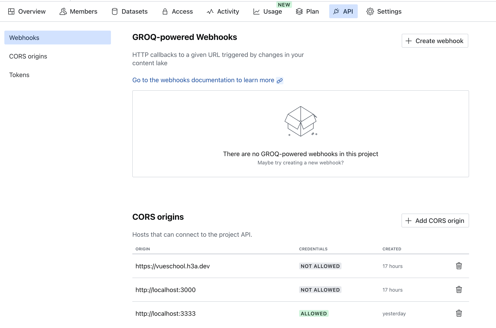

<p align='center'>
  
</p>

<p align='center'>
  Blazingly fast<sup><em>(speed)</em></sup><br>
</p>

<br>

<p align='center'>
  See the
  <a href="https://vueschool.h3a.dev">Live Version</a>
</p>
<br>
<p align='center'>
  
</p>
<br>

## Features

- ⚡️ [Nuxt 3](https://github.com/vuejs/core), [pnpm](https://pnpm.io/), [TailwindCSS](https://tailwindcss.com/), [Sanity CMS](https://www.sanity.io/), [ESLint](https://eslint.org/), [Prettier](https://prettier.io/)

- 🦾 TypeScript

- Blazingly fast and well optimized
<p align='center'>
  
</p>
<br>

## Starting the project

### Prerequisites

- A [sanity.io](https://www.sanity.io/) account. 

- The [sanity cli](https://www.sanity.io/docs/cli).

- [NodeJS](https://nodejs.org) - Tested on version 18.19.0 and NPM version 10.2.3


### Steps

1.  Sign into your [sanity.io](https://www.sanity.io/) account and created a project if you don't already have one. Copy the project Id up top. Switch to the Datasets tab and copy the mane of the dataset you want to use. For this test, I'm using "production".
<p align='center'>
  
</p>
<br>

2.  Go tho the api section of your [sanity.io](https://www.sanity.io/) dashboard and add `http:localhost:3000` to the list of CORS origins. This will prevent the nuxt app from being blocked by CORS when making a request to sanity. If you're going to host the app, ensure the domain is also added to the allowed origins.
<p align='center'>
  
</p>
<br>

2.  Clone the github project . This will create a `vue-school` folder in your current directory. Open it in your preferred text editor or IDE.
```bash
git clone git@github.com:hope-ag/vue-school.git

cd vue-school

git checkout tailwind-design
```

3. Create a copy of [`env.example`](./env.example) and rename it to .env. Open the new [`.env`](./.env) and replace the following values: `YOUR_PROJECT_ID` - the project id from your sanity dashboard; `YOUR_DATASET` - the dataset from your sanity dashboard.

4. Open [`sanity/sanity.config.ts`](./sanity/sanity.config.ts) and [`sanity/sanity.cli.ts`](./sanity/sanity.cli.ts) and in each file, replace the following values: `YOUR_PROJECT_ID` - the project id from your sanity dashboard; `YOUR_DATASET` - the dataset from your sanity dashboard.

5. Open a terminal and install the nuxt project dependencies:
```bash
# npm
npm i

# pnpm
pnpm i

# yarn
yarn
```

6. Install the sanity cli, if you haven't already done so and authenticate:
```bash
# npm
npm install --global @sanity/cli

# yarn
yarn global add @sanity/cli

# pnpm
pnpm install --global @sanity/cli

# sanity login
sanity login
```

7. Open a terminal and switch to the sanity folder with `cd sanity`. Install the dependencies:
```bash
# npm
npm i

# pnpm
pnpm i

# yarn
yarn
```

<br>
<br>
At this point, you should be all set and ready to run the project.
 
 From your terminal in the sanity directory, import the site data  into your sanity dataset by running the following command. Replace `YOUR_DATASET` with the name of your dataset
 ```bash
 sanity dataset  import dataset.gz YOUR_DATASET
 ```

 With the dataset imported, you can now start the project. Navigate to the project root by running `cd ..` from the sanity folder. Then start the development server on http://localhost:3000:
 ```bash
 # npm
 npm run dev

 # pnpm
 pnpm run dev

 # yarn
 yarn dev
 ```

## Updating content with sanity studio

A full recording of the guide can be found [here](https://pub-3e807a11392046e08f3614e5f9dabe9d.r2.dev/vs-guide.mp4). In the video, the http://localhost:3000 was not added to the allowed origins, remember to add it (check step 2)
